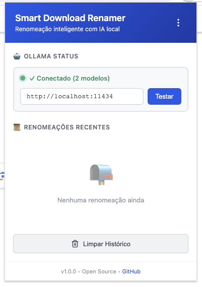
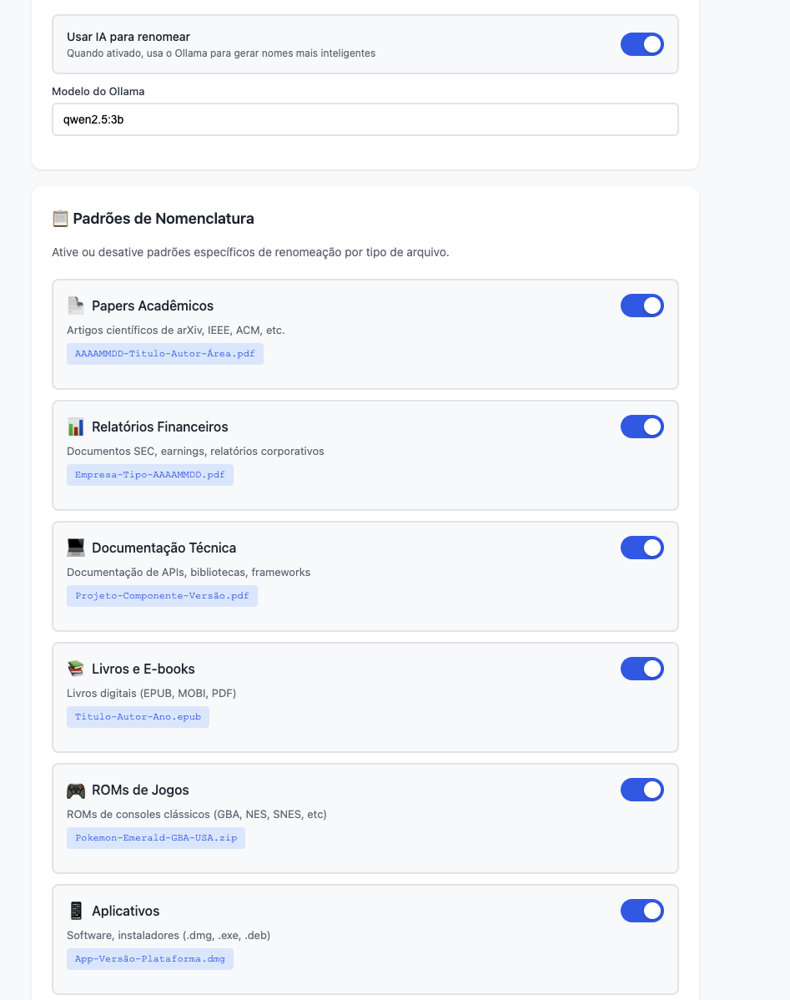

# Smart Download Renamer

[](LICENSE) 

> Renomeie automaticamente arquivos baixados com inteligência contextual — localmente, com suporte opcional a modelos LLM via Ollama.

**Resumo**

O Smart Download Renamer intercepta downloads em navegadores Chromium e propõe nomes inteligentes baseados no contexto do arquivo (URL, domínio, tipo, metadados). Quando disponível, usa um modelo LLM local via Ollama para gerar nomes mais precisos; caso contrário, aplica regras heurísticas.

<p align="center">
  
</p>

[](link-futuro)
[](LICENSE)
[](CONTRIBUTING.md)

## ✨ Funcionalidades principais

- **IA local (opcional)**: integração com Ollama para geração de nomes usando modelos locais.
- **Detecção de contexto**: identifica tipos comuns (papers, ROMs, instaladores, relatórios financeiros, releases GitHub).
- **Padrões configuráveis**: formatos de nomenclatura por tipo de arquivo.
- **Privacidade**: processamento local — nenhum conteúdo é enviado para servidores externos.
- **Compatível com Chromium**: Chrome, Edge, Brave e derivados (Manifest V3).

### Exemplos de Renomeação

**Paper Acadêmico:**
Antes: 2301.12345v1.pdf

Depois: 20260111-Attention-Is-All-You-Need-Vaswani-NLP.pdf

**ROM de Jogo:**
Antes: fflII-Version-(USA,-Europe).zip

Depois: Final-Fantasy-Legend-II-GBA-USA.zip

**Aplicativo do GitHub:**
Antes: zen-macos-universal.dmg

Depois: Zen-Browser-MacOS-Universal.dmg


## 📸 Demo & Screenshots

Veja a demonstração animada acima. Imagens adicionais:

<p align="center">
    
    <br>
    <em>Interface principal da extensão</em>
</p>

<p align="center">
    
    <br>
    <em>Página de configurações com padrões personalizáveis</em>
</p>

## 🚀 Quick Start (Desenvolvedor)

1. Clone o repositório:

```bash
git clone https://github.com/seu-usuario/smart-download-renamer.git
cd smart-download-renamer
```

2. (Opcional) Instale e prepare o Ollama para usar IA local:

- Visite https://ollama.ai e siga as instruções de instalação para seu SO.
- Baixe um modelo recomendado, por exemplo:

```bash
ollama qwen2.5:3b
```

3. Carregue a extensão no navegador Chromium (modo desenvolvedor):

- Abra `chrome://extensions/` (ou `edge://extensions/`)
- Ative **Modo do desenvolvedor**
- Clique em **Carregar sem compactação** e selecione a pasta do projeto

4. Abra o ícone da extensão e ajuste as configurações conforme necessário.

## Uso

- Ative/desative a geração por IA nas configurações.
- (Opcional)Configure padrões de nomenclatura por tipo (ex.: Papers: `YYYYMMDD-Title-Authors.pdf`).
- Inicie um download — a extensão sugerirá/atribuirá um novo nome automaticamente.

## Requisitos

- Navegador: Chromium (v140+)
- Ollama (opcional): necessário apenas para geração via LLM local
- Memória: mínimo 8GB (16GB recomendado para modelos maiores)

## Arquitetura & Tecnologias

- Manifest V3 (service worker)
- JavaScript (compatibilidade ampla)
- Integração opcional com Ollama (API local)
- Armazenamento: Chrome Storage API

Fluxo simplificado:

1. Download iniciado
2. Listener intercepta e extrai contexto (URL, headers, nome original)
3. Detecta tipo/padrão
4. Gera nome via Ollama (se habilitado) ou via regras
5. Sanitiza, valida e aplica o novo nome

## Segurança & Privacidade

- Processamento local: nenhum upload para terceiros
- Permissões mínimas no Manifest
- CSP rigoroso e sanitização de entradas

## Contribuindo

Contribuições são bem-vindas!

- Fork este repositório
- Crie uma branch com sua feature: `git checkout -b feature/minha-feature`
- Abra um Pull Request descrevendo a mudança

## Problemas conhecidos

- Ollama precisa estar rodando antes do primeiro uso da IA
- A primeira geração pode demorar enquanto o modelo inicializa
- Em alguns sites, a URL pode não conter informações suficientes para renomear com alta precisão


## Licença

Este projeto está licenciado sob a Licença MIT — veja o arquivo `LICENSE`.

## Agradecimentos

- Ollama — LLMs local
- Lucide Icons — ícones
